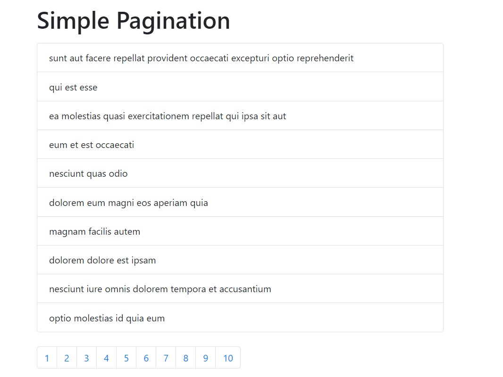

# Simple Pagination



## Setup

To clone and run this application, you'll need [Git](https://git-scm.com/) and [Node.js](https://nodejs.org/) (which comes with [npm](https://www.npmjs.com/)) installed on your computer. From your command line:

```sh
# Clone this repository
$ git clone https://github.com/andyrutherford/simple-pagination.git

# Go into the repository
$ cd

# Install dependencies
$ npm install

# Run the app
$ npm run start
```

## Tech

- [ReactJS](https://reactjs.org/) - A JavaScript library for building user interfaces
- [axios](https://github.com/axios/axios) - Promise based HTTP client for the browser and node.js
- [jsonPlaceholder](https://jsonplaceholder.typicode.com/) - Fake Online REST API for Testing and Prototyping
- [Bootstrap CDN](https://www.bootstrapcdn.com/) - for styling

## Demo

Here is a working live demo:

## License

MIT
